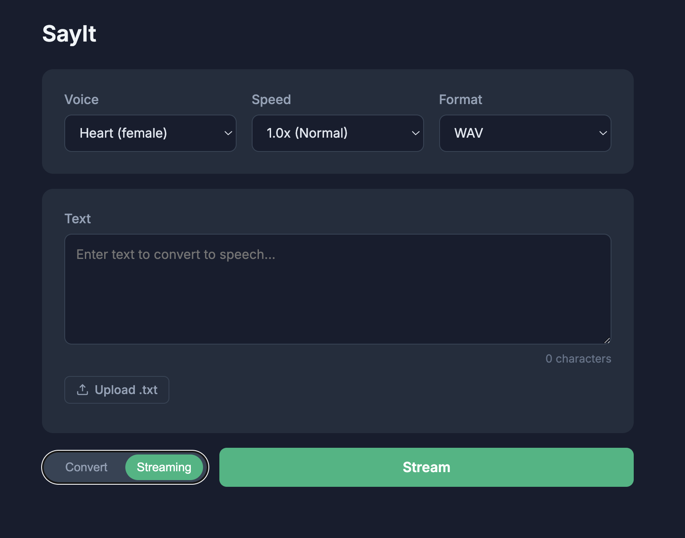

# SayIt

A TTS Web App powered by [Kokoro TTS](https://github.com/hexgrad/kokoro) (82M parameter model).



## Quick Start

### Prerequisites

- Python 3.10-3.12
- espeak-ng (for non-English languages)
- ffmpeg (for MP3 support)

#### macOS

```bash
brew install espeak-ng ffmpeg
```

#### Ubuntu/Debian

```bash
sudo apt-get install espeak-ng ffmpeg
```

### Installation

```bash
# Clone the repository
git clone <repository-url>
cd sayit

# Install dependencies
uv sync
```

### Start Server

```bash
# Development (with auto-reload)
uv run uvicorn app.main:app --host 0.0.0.0 --port 8000 --reload

# Production
uv run uvicorn app.main:app --host 0.0.0.0 --port 8000
```

Server runs at **http://localhost:8000**

### Stop Server

Press `Ctrl+C` in the terminal where the server is running.

## Model Download

The Kokoro-82M TTS model (~313MB) is automatically downloaded from Hugging Face
on the first TTS request. To avoid the initial delay, pre-download it:

```bash
uv run python -c "from huggingface_hub import snapshot_download; snapshot_download('hexgrad/Kokoro-82M')"
```

## License

This project uses the Kokoro TTS model. Please refer to the [Kokoro license](https://github.com/hexgrad/kokoro) for model usage terms.
